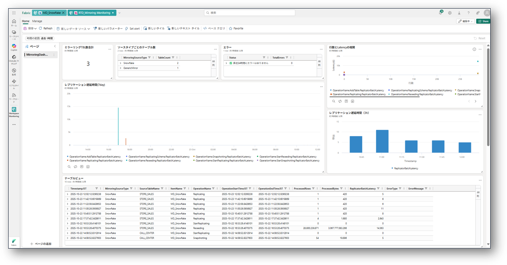

# fabric-mirroring-monitoring

# Fabric Mirroring Monitoring

This repository provides a collection of **KQL queries** to monitor **database mirroring in Microsoft Fabric** in **real time**.

Currently, the following official template does **not** include a real-time monitoring dashboard for Mirroring.  
To help anyone who needs monitoring right away, I created a simple dashboard template using KQL 👇

🔗 Microsoft Fabric – Official Workspace Monitoring Dashboards  
https://github.com/microsoft/fabric-toolbox/tree/main/monitoring/workspace-monitoring-dashboards

---

## ✅ What You Can Do with This Repository

- Visualize replication latency in real time
- Monitor errors detected in the last 24 hours
- Track processed rows and processed bytes
- Monitor mirrored table counts by source type
- Analyze MirroredDatabaseTableExecutionLogs

---

## 📌 Use Cases

- You are mirroring Snowflake or other databases with Fabric
- You want to track replication status in real time
- You want monitoring before an official mirroring dashboard becomes available

---

## 🚀 How to Use

1. Open **[New visual tile]** in Real-Time Dashboard  
2. Copy and paste any KQL query from this repository  
3. Adjust the visual formatting referring to the sample dashboard image, then apply

---

> Contributions, improvements, or feedback are always welcome! 🚀
